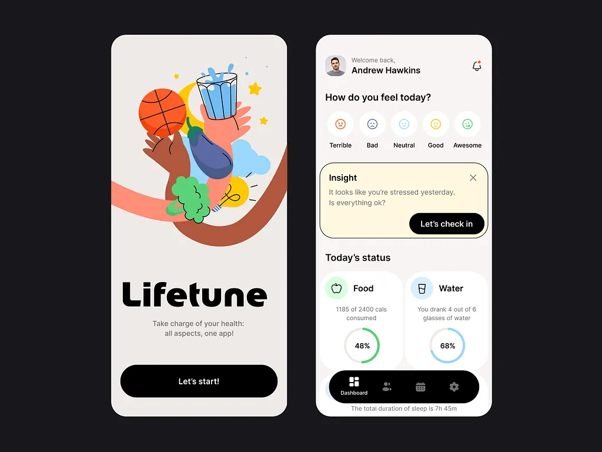

# 💚 LifeTune – All-in-One Health App

A unified **Flutter** mobile app concept that combines fitness, meditation, diet, and hydration tracking into one seamless experience.



---

## 🧠 Concept

Juggling 5 different health apps?  
This concept brings everything — **fitness**, **meditation**, **diet**, and **hydration** — into one clean, intuitive app.

> 💡 A modern health app experience — brought to life with Flutter for iOS & Android.  
> 👉 [Check out the source code](https://www.instagram.com/reel/DIx0tqQz3CV/)  
> ✉️ DM me to bring **your idea** to life.

---

## ✨ Features

- 🏋️ Fitness Tracking
- 🧘 Guided Meditation
- 🥗 Diet & Nutrition Overview
- 💧 Hydration Reminders
- 🛠️ Built entirely in **Flutter**

## 🚀 Getting Started

To run this project locally:

```bash
git clone https://github.com/codewithmashi/lifetune.git
cd lifetune
flutter pub get
flutter run
```

---

## ⚙️ Tech Stack

- Flutter (Latest stable version)
- Dart
- GetX

---

## 🤝 Contribute

Pull requests are welcome! If you'd like to improve the app or add features, feel free to fork and submit a PR.

---

## 📎 Links

- 🔗 **Source Code:** [GitHub Repo](https://github.com/codewithmashi/lifetune)  
- 📲 **More UI & Dev Inspiration:** [@codewithmashi](https://instagram.com/codewithmashi)
